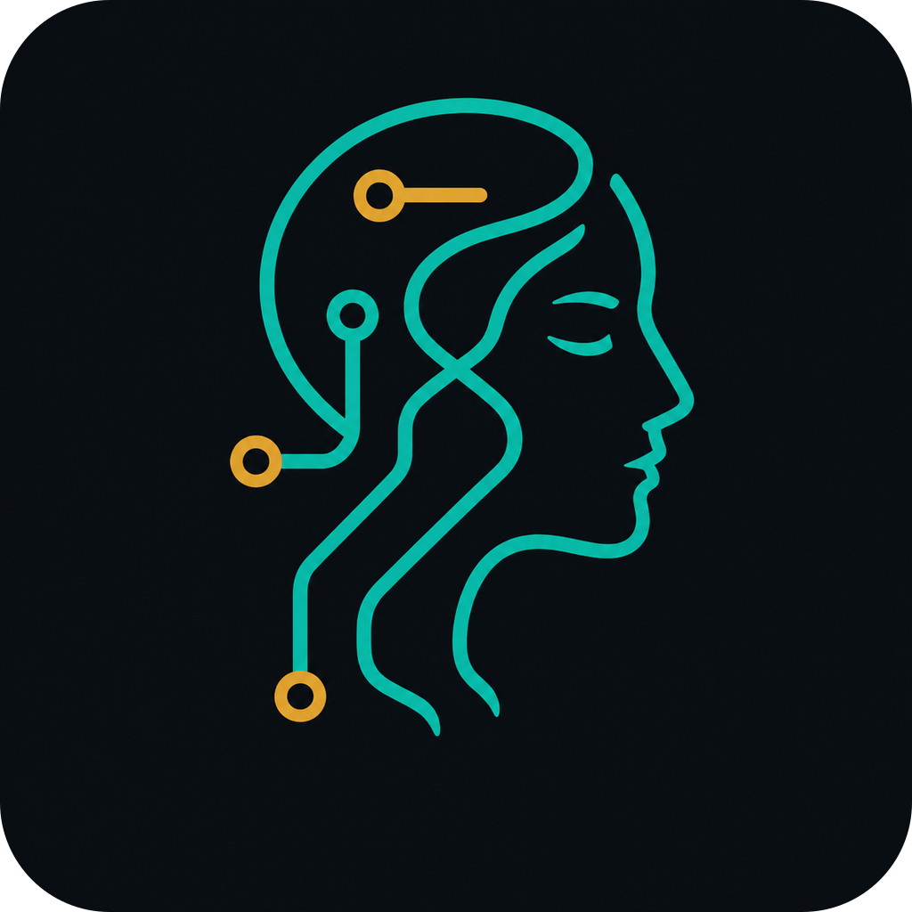
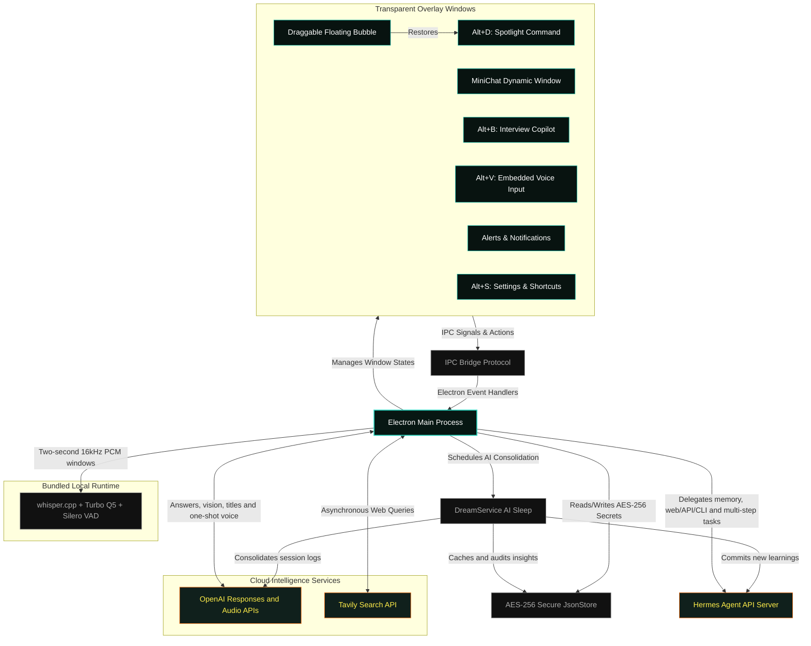

<table>
  <tr>
    <td width="35%" align="center" valign="top">
      
      <p align="center" style="margin-top: 10px; margin-bottom: 0;">
        
        
        
      </p>
    </td>
    <td width="65%" valign="top" style="padding-left: 20px;">
      <h1 style="margin-top: 0; margin-bottom: 8px;">Metis</h1>
      <p><strong>Metis is an always-on desktop assistant with live transcription, contextual chat, visual understanding, Hermes-backed memory, and a draggable floating bubble.</strong></p>
      <p><strong>Safety Model:</strong> the renderer stays sandboxed behind a typed IPC bridge. API keys are stored locally, Hermes access is opt-in, and privileged operations remain in the Electron main process.</p>
    </td>
  </tr>
</table>

<p align="center" style="margin-top: 20px;">
  <a href="https://github.com/fbsis/hades-agent/releases"></a>
  <a href="https://github.com/fbsis/hades-agent/blob/master/LICENSE"></a>
  <a href="https://github.com/fbsis/hades-agent"></a>
  <a href="https://github.com/fbsis/hades-agent"></a>
</p>

<table>
<tr>
  <td><b>🛡️ Screen-Share Privacy</b></td>
  <td>Native OS-level content protection via <code>setContentProtection</code>. Support varies by operating system and capture application, so this is a privacy aid rather than a guarantee of invisibility.</td>
</tr>
<tr>
  <td><b>🎙️ Interview Copilot (Alt+B)</b></td>
  <td>Capture system audio with bundled, local <strong>whisper.cpp</strong> transcription and stream interview answers from <strong>OpenAI</strong> when you use the answer controls or shortcuts. No cloud transcription fallback is used.</td>
</tr>
<tr>
  <td><b>⚡ Spotlight Command Bar</b></td>
  <td>Press <code>Alt+D</code> to summon a floating, borderless command workspace with MiniChat, Settings, live transcription, and one-shot voice input in one unified window.</td>
</tr>
<tr>
  <td><b>💬 Session MiniChat</b></td>
  <td>A persistent chat HUD that can route most reasoning to <strong>Hermes</strong>, use OpenAI for visual context and fallback, display token usage, and keep the active assistant mode close to your workflow.</td>
</tr>
<tr>
  <td><b>🧠 Dream Memory Consolidation</b></td>
  <td>Scheduled background cycles use the OpenAI Responses API to compress recent session logs, keep a local audit cache in <code>learnings.json</code>, and forward reusable knowledge to <strong>Hermes persistent memory</strong>.</td>
</tr>
<tr>
  <td><b>🤖 Hermes Primary Agent</b></td>
  <td>Metis can use a local <strong>Hermes Agent</strong> server as the main brain for MiniChat, memory, web/API/CLI, research, suggestions, and multi-step work while OpenAI handles latency-sensitive interview questions and screenshots.</td>
</tr>
<tr>
  <td><b>👁️ Visual Context</b></td>
  <td>OpenAI reads screenshots captured during interviews, extracts the visible question, code and alternatives, and produces the interview answer from that visual context.</td>
</tr>
<tr>
  <td><b>🫧 Floating Bubble Mode</b></td>
  <td>Minimize the app into a transparent, draggable, always-on-top chat bubble. Its position is persisted and clicking it restores the unified command window.</td>
</tr>
<tr>
  <td><b>🎤 Embedded Voice Input</b></td>
  <td><code>Alt+V</code> opens a one-shot voice recorder inside the same command window, transcribes audio with OpenAI, and sends the result back to MiniChat.</td>
</tr>
<tr>
  <td><b>📋 Safe Task Scheduler</b></td>
  <td>A strictly sandboxed, <strong>offline task ledger</strong> with zero system-write permissions. Safely schedule automated web searches, create daily reminders, and organize MiniChat responses without risking modifications to your local files. Managed through encrypted IPC database handlers.</td>
</tr>
</table>

---

##  Getting Started

### For Users (Download Installer)

1. Head to the **[Releases](https://github.com/fbsis/hades-agent/releases)** page.
2. Download **`Metis-Setup-1.0.0.exe`** (or the `.zip` portable version).
3. Run the installer, launch Metis, then press **`Alt+S`** to enter your API keys.

> [!WARNING]
> **Platform:** Metis was originally built for **Windows**, but the repository now includes macOS packaging support via `electron-builder --mac`. Some macOS-specific behavior still needs validation, especially around tray icon presentation and stealth window handling.

> [!IMPORTANT]
> Metis requires an **[OpenAI API key](https://platform.openai.com/api-keys)** for answers, screenshots, titles, Dreaming, and one-shot voice transcription. Continuous interview transcription runs locally and does not require an API key. A **[Tavily Search API key](https://app.tavily.com/)** is optional for direct web search.

### For Developers (Build from Source)

**Prerequisites**

| Requirement | Version | Notes |
| :--- | :--- | :--- |
| [Node.js](https://nodejs.org/) | v22.12.0 or newer | Required by Electron 42 |
| npm | bundled with Node.js | — |
| Windows or macOS | 10 / 11 / Ventura+ | macOS build is supported via `electron-builder --mac` |
| CMake | 3.10+ | macOS only; compiles the native `whisper.cpp` server |
| curl | current | downloads the pinned runtime source and multilingual model |

```bash
# 1. Clone the repository
git clone git@github.com:fbsis/hades-agent.git
cd hades-agent

# 2. Install all dependencies
npm install

# 3. Launch the concurrent hot-reload dev environment
npm run dev
```

The first `npm run dev` downloads the quantized multilingual Whisper `large-v3-turbo-q5_0` model and prepares the native runtime. Later starts reuse those files, clear stale Metis Electron processes, then launch Vite and Electron concurrently.

### Build / Package commands

- `npm run package:win` — package a Windows installer
- `npm run package:mac` — package a macOS `.dmg` and `.zip`
- `npm run package:mac:arm64` — package only the Apple Silicon macOS `.dmg` and `.zip`
- `npm run dist:win` — build production assets and package for Windows
- `npm run dist:mac` — build production assets and package for macOS
- `npm run dist:mac:arm64` — build production assets and package only for macOS ARM64

### Hermes Agent

Metis can connect to a local Hermes Agent API server for MiniChat, persistent memory, context-aware interviews, web/API/CLI work, research, suggestions and multi-step tasks.

Metis remains the desktop UI/audio assistant. Hermes becomes the primary agent when enabled. OpenAI handles visual context, session titles, latency-sensitive interview answers, and the fallback when Hermes is unavailable. Metis never falls back to a Google AI service.

Enable the Hermes API server in `~/.hermes/.env`:

```env
API_SERVER_ENABLED=true
API_SERVER_KEY=replace-this-key
API_SERVER_HOST=127.0.0.1
API_SERVER_PORT=8642
```

Start Hermes:

```bash
hermes gateway
```

Open **Settings > Agent**, enable Hermes, keep **Use Hermes as primary agent** on, set the Base URL to `http://127.0.0.1:8642`, fill the API key and test the connection.

See [docs/hermes-agent.md](docs/hermes-agent.md) for memory behavior, low-token routing, modes, resume/interview workflow and the recommended Hermes setup.

### Dreaming

Dreaming runs ten seconds after startup and then every 24 hours. Configure an OpenAI API key under **Settings > Configuration** and keep Hermes memory enabled.

The consolidation flow is:

1. Metis collects completed assistant turns in `~/.Metis/sessions`.
2. OpenAI `gpt-5.6-luna` extracts up to five reusable learnings through the Responses API with low verbosity, no reasoning overhead, and `store: false`.
3. Metis stores a local audit entry in `~/.Metis/memory/learnings.json`.
4. Metis tells Hermes that new learnings are available and asks the agent to commit them to its own persistent memory.
5. Failed Hermes syncs remain pending and are retried during later Dreaming cycles.

Recorded meetings and interviews follow a separate direct path that does not require OpenAI consolidation:

1. Finishing a session with saved audio persists its final transcript and starts a background Dreaming cycle.
2. Metis sends Hermes a stable memory ID, session metadata, company/person, existing summary, and compact transcript.
3. Hermes is instructed to always create a base memory for the meeting and retain reusable decisions, commitments, tasks, people, projects, preferences, and experiences.
4. The session stores a `pending` or `synced` memory status. Pending sessions retry on later Dreaming cycles, while synced IDs are never sent twice.

OpenAI is the only remote model provider used by Metis. Hermes still owns agent workflows and persistent memory when enabled; local Whisper owns continuous interview transcription.

### Interview Copilot

Open **Options > Interview** or press `Alt+B`. A meeting can optionally identify the company or person involved. For interviews, set the target role, company, resume, job description, language, answer style, and optional instructions.

- Local Whisper is the default transcription provider. Metis bundles `whisper.cpp` v1.9.1 and the quantized multilingual `large-v3-turbo-q5_0` model in packaged builds and transcribes two-second PCM windows without an API key or per-minute charge. The model adds about 547 MB before installer compression.
- The model is loaded only after interview listening starts. System audio and the optional microphone share one server; pausing or finishing the final transcription source terminates that server and releases the model memory.
- A bundled Silero VAD 6.2 model rejects non-speech segments before inference. Adaptive noise detection, a 240 ms speech pre-roll, and a second PCM activity gate prevent silence hallucinations and preserve quiet word beginnings.
- Portuguese is the default recognition language to avoid unreliable language detection on short windows. Select English or automatic detection in the interview setup when needed.
- `npm run whisper:prepare` prepares the current machine explicitly. macOS builds compile a static Metal/Accelerate-enabled server; Windows x64 builds use the official prebuilt runtime. Generated binaries and model files stay outside Git and are copied into the application by `electron-builder`.
- System audio is transcribed locally by default. Microphone transcription is optional and remains a separate source so speakers stay separated.
- If local Whisper is unavailable, the interview shows an error instead of sending audio to a remote fallback.
- The latest likely interviewer question is highlighted locally without an LLM request. Every finalized interviewer turn still has an explicit **Answer** action.
- Use the answer field or press `F4` to send the latest five conversation texts, resume, job description, and interview instructions to a separate OpenAI Responses stream. The transcript continues while OpenAI responds.
- Click **Quick answer** to flush the active transcription stream, infer the question from the latest five transcription fragments, and stream a short summary followed by speaking points.
- Use the answer toolbar to stop, copy, shorten, expand, rewrite as STAR, generate code, or retry.
- Screen capture is manual. OpenAI Vision reads the current display, extracts the visible question, code, alternatives, and terminal context, then answers with the technical interview prompt.
- Each OpenAI interview answer sends only the latest five conversation texts, session metadata, the configured resume and job description, and optional screen context. Requests use `store: false`.
- Transcripts and answers are stored in `interview_sessions.json`. Audio recording is enabled by default and can be disabled per session; WAV artifacts are stored under the app's local `interview-audio` directory. Recorded sessions keep their transcript even if the separate transcript toggle is off, because that text is required for Hermes memory.

---

##  Keyboard Shortcuts

Metis opens as a compact command window by default and can be minimized into a draggable floating bubble:

| Shortcut | Action |
| :--- | :--- |
| **`Alt+D`** | Summon / dismiss the unified command window |
| **`Alt+B`** | Open the Interview Copilot |
| **`Space`** | Answer the selected interview question when no input is focused |
| **`Alt+S`** | Open Settings & Shortcut Customization |
| **`Alt+V`** | Open one-shot voice input mode |
| **`Esc`** | Hide the active window and restore prior focus |

> [!TIP]
> Every shortcut is fully rebindable. Open the **Shortcuts** tab inside Settings (`Alt+S`) to assign your own key combinations.

---

##  System Architecture

Metis orchestrates multiple transparent overlay windows through a strict **IPC event bridge**, keeping the renderer completely sandboxed from the filesystem while the main process handles all privileged operations:



---

##  AI-Assisted Engineering

Metis was co-engineered with **[Google Antigravity](https://deepmind.google/)** (Advanced Agentic Coding Assistant by Google DeepMind) using **Subagent-Driven Development (SDD)**:

- **Modular Autonomy:** Specialized subagents independently built IPC event engines, AES-256 cryptography wrappers, voice PCM pipelines, and window lifecycle managers — each validated in isolation before integration.
- **Strict Quality Gates:** Architecture enforces minimal custom React hook sizes, a single centralized state store (`jsonStore.js`), and production Vite compilation times consistently under **760 ms**.
- **Continuous Hardening:** Security subagents enforced sandbox isolation, Content Security Policy headers, and `contextIsolation` at every IPC boundary, with no `nodeIntegration` exposure to the renderer.

---

##  Inspiration & Credits

> [!NOTE]
> Metis is inspired by **Persua**, a conceptual real-time voice and AI assistant created by software engineer **Lucas Montano** ([@lucasmontano](https://github.com/lucasmontano)). Metis was engineered entirely from scratch to explore raw PCM streaming, full-duplex WebSockets, and OS-level content-protection algorithms in Electron. Thank you, Lucas, for pushing the community to build things that don't exist yet.

---

##  Star History

[](https://www.star-history.com/?repos=fbsis%2Fhades-agent&type=date&legend=top-left)

---

##  License

MIT — See [LICENSE](LICENSE).

Bundled Whisper components are listed in [THIRD_PARTY_NOTICES.md](THIRD_PARTY_NOTICES.md).

Maintained by [fbsis](https://github.com/fbsis).
