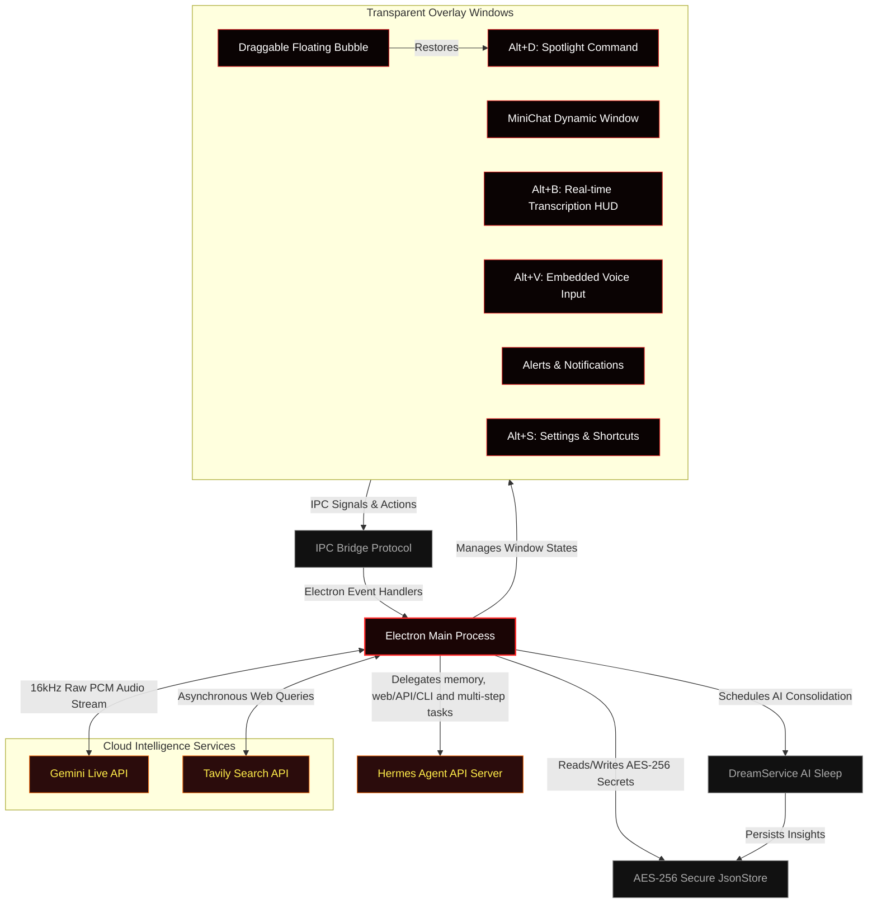

<p align="center">
  
</p>

<table>
  <tr>
    <td width="35%" align="center" valign="top">
      
      <p align="center" style="margin-top: 10px; margin-bottom: 0;">
        
        
        
      </p>
    </td>
    <td width="65%" valign="top" style="padding-left: 20px;">
      <h1 style="margin-top: 0; margin-bottom: 8px;">Hades Agent </h1>
      <p><strong>Hades is an always-on desktop assistant with live transcription, contextual chat, visual understanding, Hermes-backed memory, and a draggable floating bubble.</strong></p>
      <p><strong>Safety Model:</strong> the renderer stays sandboxed behind a typed IPC bridge. API keys are stored locally, Hermes access is opt-in, and privileged operations remain in the Electron main process.</p>
    </td>
  </tr>
</table>

<p align="center" style="margin-top: 20px;">
  <a href="https://github.com/fbsis/hades-agent/releases"></a>
  <a href="https://github.com/fbsis/hades-agent/blob/master/LICENSE"></a>
  <a href="https://github.com/fbsis/hades-agent"></a>
  <a href="https://github.com/fbsis/hades-agent"></a>
</p>

<table>
<tr>
  <td><b>🛡️ Anti-Recording Shield</b></td>
  <td>Native OS-level content protection via <code>setContentProtection</code>. Hades becomes <strong>completely invisible</strong> to OBS Studio, Discord, Teams, Zoom, and all Windows screen-capture APIs — your private data never leaks through shared screens.</td>
</tr>
<tr>
  <td><b>🎙️ Real-time Transcription (Alt+B)</b></td>
  <td>Open the Susurro panel to capture system audio, stream raw <strong>16 kHz PCM</strong> to <strong>Gemini Live</strong>, render low-latency deltas, locally finalize turns, ask questions over the transcript, and send meeting summaries to Hermes.</td>
</tr>
<tr>
  <td><b>⚡ Spotlight Command Bar</b></td>
  <td>Press <code>Alt+D</code> to summon a floating, borderless command workspace with MiniChat, Settings, live transcription, and one-shot voice input in one unified window.</td>
</tr>
<tr>
  <td><b>💬 Session MiniChat</b></td>
  <td>A persistent chat HUD that can route most reasoning to <strong>Hermes</strong>, use Gemini for visual context and fallback, display token usage, and keep the active assistant mode close to your workflow.</td>
</tr>
<tr>
  <td><b>🧠 Dream Memory Consolidation</b></td>
  <td>Scheduled background AI cycles synthesize recent session logs into a <strong>compressed <code>learnings.json</code> memory profile</strong> — similar to how the brain consolidates long-term memory during sleep. Runs fully offline.</td>
</tr>
<tr>
  <td><b>🤖 Hermes Primary Agent</b></td>
  <td>Hades can use a local <strong>Hermes Agent</strong> server as the main brain for MiniChat, memory, web/API/CLI, interview, research, suggestions, and multi-step work while keeping Gemini on the fast transcription path.</td>
</tr>
<tr>
  <td><b>👁️ Gemini Visual Context</b></td>
  <td>Images are read by Gemini first. Hades extracts text, code, UI state, and visible answers, then either answers directly or forwards compact visual context to Hermes.</td>
</tr>
<tr>
  <td><b>🫧 Floating Bubble Mode</b></td>
  <td>Minimize the app into a transparent, draggable, always-on-top chat bubble. Its position is persisted and clicking it restores the unified command window.</td>
</tr>
<tr>
  <td><b>🎤 Embedded Voice Input</b></td>
  <td><code>Alt+V</code> opens a one-shot voice recorder inside the same command window, transcribes audio with Gemini, and sends the result back to MiniChat.</td>
</tr>
<tr>
  <td><b>📋 Safe Task Scheduler</b></td>
  <td>A strictly sandboxed, <strong>offline task ledger</strong> with zero system-write permissions. Safely schedule automated web searches, create daily reminders, and organize MiniChat responses without risking modifications to your local files. Managed through encrypted IPC database handlers.</td>
</tr>
</table>

---

##  Getting Started

### For Users (Download Installer)

1. Head to the **[Releases](https://github.com/fbsis/hades-agent/releases)** page.
2. Download **`Hades-Agent-Setup-1.0.0.exe`** (or the `.zip` portable version).
3. Run the installer, launch Hades, then press **`Alt+S`** to enter your API keys.

> [!WARNING]
> **Platform:** Hades was originally built for **Windows**, but the repository now includes macOS packaging support via `electron-builder --mac`. Some macOS-specific behavior still needs validation, especially around tray icon presentation and stealth window handling.

> [!IMPORTANT]
> Hades requires two free API keys to operate:
> - **[Google Gemini API Key](https://aistudio.google.com/app/apikey)** — for all AI inference and voice streaming.
> - **[Tavily Search API Key](https://app.tavily.com/)** — for real-time web search grounding.

### For Developers (Build from Source)

**Prerequisites**

| Requirement | Version | Notes |
| :--- | :--- | :--- |
| [Node.js](https://nodejs.org/) | v22.12.0 or newer | Required by Electron 42 |
| npm | bundled with Node.js | — |
| Windows or macOS | 10 / 11 / Ventura+ | macOS build is supported via `electron-builder --mac` |

```bash
# 1. Clone the repository
git clone git@github.com:fbsis/hades-agent.git
cd hades-agent

# 2. Install all dependencies
npm install

# 3. Launch the concurrent hot-reload dev environment
npm run dev
```

The dev server first clears stale Hades Electron processes, then starts Vite (React renderer on `:3000`) and Electron concurrently with full hot-reload on both sides.

### Build / Package commands

- `npm run package:win` — package a Windows installer
- `npm run package:mac` — package a macOS `.dmg` and `.zip`
- `npm run dist:win` — build production assets and package for Windows
- `npm run dist:mac` — build production assets and package for macOS

### Hermes Agent

Hades can connect to a local Hermes Agent API server for MiniChat, persistent memory, context-aware interviews, web/API/CLI work, research, suggestions and multi-step tasks.

Hades remains the desktop UI/audio assistant. Hermes becomes the primary agent when enabled. Gemini stays on the fast transcription path, session titles and fallback.

Enable the Hermes API server in `~/.hermes/.env`:

```env
API_SERVER_ENABLED=true
API_SERVER_KEY=replace-this-key
API_SERVER_HOST=127.0.0.1
API_SERVER_PORT=8642
```

Start Hermes:

```bash
hermes gateway
```

Open **Settings > Agent**, enable Hermes, keep **Use Hermes as primary agent** on, set the Base URL to `http://127.0.0.1:8642`, fill the API key and test the connection.

See [docs/hermes-agent.md](docs/hermes-agent.md) for memory behavior, low-token routing, modes, resume/interview workflow and the recommended Hermes setup.

---

##  Keyboard Shortcuts

Hades opens as a compact command window by default and can be minimized into a draggable floating bubble:

| Shortcut | Action |
| :--- | :--- |
| **`Alt+D`** | Summon / dismiss the unified command window |
| **`Alt+B`** | Open the real-time transcription panel |
| **`Alt+S`** | Open Settings & Shortcut Customization |
| **`Alt+V`** | Open one-shot voice input mode |
| **`Esc`** | Hide the active window and restore prior focus |

> [!TIP]
> Every shortcut is fully rebindable. Open the **Shortcuts** tab inside Settings (`Alt+S`) to assign your own key combinations.

---

##  System Architecture

Hades orchestrates multiple transparent overlay windows through a strict **IPC event bridge**, keeping the renderer completely sandboxed from the filesystem while the main process handles all privileged operations:



---

##  AI-Assisted Engineering

Hades was co-engineered with **[Google Antigravity](https://deepmind.google/)** (Advanced Agentic Coding Assistant by Google DeepMind) using **Subagent-Driven Development (SDD)**:

- **Modular Autonomy:** Specialized subagents independently built IPC event engines, AES-256 cryptography wrappers, voice PCM pipelines, and window lifecycle managers — each validated in isolation before integration.
- **Strict Quality Gates:** Architecture enforces minimal custom React hook sizes, a single centralized state store (`jsonStore.js`), and production Vite compilation times consistently under **760 ms**.
- **Continuous Hardening:** Security subagents enforced sandbox isolation, Content Security Policy headers, and `contextIsolation` at every IPC boundary, with no `nodeIntegration` exposure to the renderer.

---

##  Inspiration & Credits

> [!NOTE]
> Hades Agent is inspired by **Persua**, a conceptual real-time voice and AI assistant created by software engineer **Lucas Montano** ([@lucasmontano](https://github.com/lucasmontano)). Hades was engineered entirely from scratch to explore raw PCM streaming, full-duplex WebSockets, and OS-level content-protection algorithms in Electron. Thank you, Lucas, for pushing the community to build things that don't exist yet.

---

##  Star History

[](https://www.star-history.com/?repos=fbsis%2Fhades-agent&type=date&legend=top-left)

---

##  License

MIT — See [LICENSE](LICENSE).

Maintained by [fbsis](https://github.com/fbsis).
